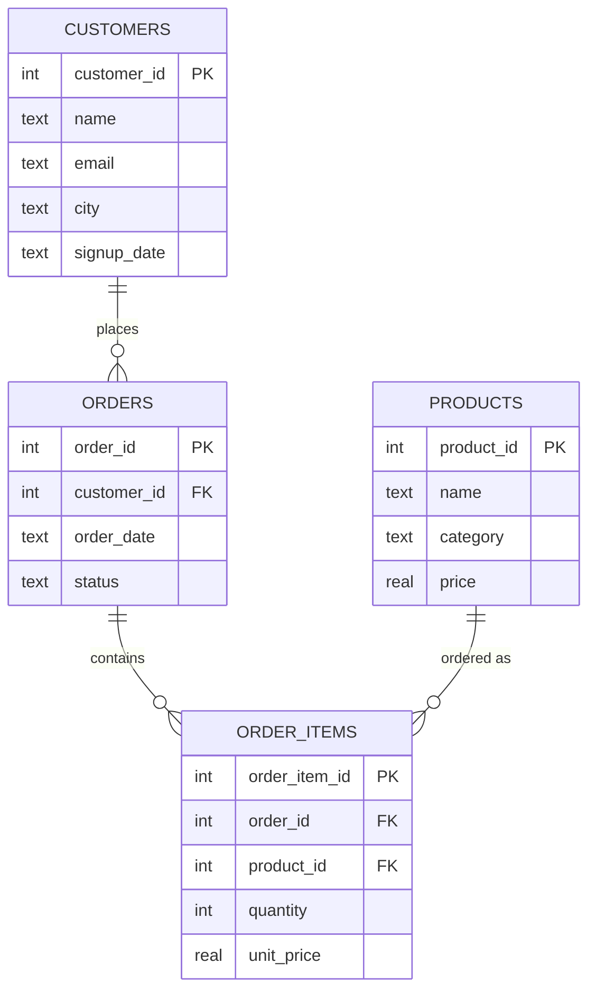

# VoiceSQL — Database Schema

Status: Finalized Day 2. This is the exact schema `database/build_db.py` must implement on Day 3, and the exact text `backend/schema.py` must embed in every AI prompt.

## Entity-Relationship Diagram

## Table Definitions

### `customers`
| Column | Type | Constraints |
|---|---|---|
| customer_id | INTEGER | PRIMARY KEY AUTOINCREMENT |
| name | TEXT | NOT NULL |
| email | TEXT | NOT NULL, UNIQUE |
| city | TEXT | |
| signup_date | TEXT | NOT NULL (ISO format `YYYY-MM-DD`) |

### `products`
| Column | Type | Constraints |
|---|---|---|
| product_id | INTEGER | PRIMARY KEY AUTOINCREMENT |
| name | TEXT | NOT NULL |
| category | TEXT | NOT NULL |
| price | REAL | NOT NULL, CHECK (price >= 0) |

### `orders`
| Column | Type | Constraints |
|---|---|---|
| order_id | INTEGER | PRIMARY KEY AUTOINCREMENT |
| customer_id | INTEGER | NOT NULL, FOREIGN KEY → customers(customer_id) |
| order_date | TEXT | NOT NULL (ISO format `YYYY-MM-DD`) |
| status | TEXT | NOT NULL, CHECK (status IN ('pending','shipped','delivered','cancelled')) |

### `order_items`
| Column | Type | Constraints |
|---|---|---|
| order_item_id | INTEGER | PRIMARY KEY AUTOINCREMENT |
| order_id | INTEGER | NOT NULL, FOREIGN KEY → orders(order_id) |
| product_id | INTEGER | NOT NULL, FOREIGN KEY → products(product_id) |
| quantity | INTEGER | NOT NULL, CHECK (quantity > 0) |
| unit_price | REAL | NOT NULL, CHECK (unit_price >= 0) |

`unit_price` is stored on `order_items` (not just looked up from `products`) so historical order totals stay accurate even if a product's current price changes later — standard e-commerce practice, and it removes any ambiguity when the AI generates revenue/aggregation queries.

## Relationships

- One customer → many orders (`customers.customer_id` → `orders.customer_id`)
- One order → many order items (`orders.order_id` → `order_items.order_id`)
- One product → many order items (`products.product_id` → `order_items.product_id`)

## Seed Data Guidance (for Day 2 setup)

- ~15 customers across a handful of different cities.
- ~15 products across at least 3 categories (e.g., Electronics, Home, Apparel).
- ~40 orders spanning several months, including some in "last month" and "this year" relative to today, so date-filtered questions have real answers.
- ~80 order_items distributed across those orders, with varied quantities.

## Schema Validated Against PRD User Stories

| PRD scenario | Query shape supported |
|---|---|
| "Show all customers" | `SELECT * FROM customers` |
| "Products under $50" | `SELECT ... FROM products WHERE price < 50` |
| "5 most recent orders" | `ORDER BY order_date DESC LIMIT 5` |
| "Total revenue from all orders" | `SUM(quantity * unit_price)` across `order_items` |
| "Which customer has spent the most" | 3-table join + `GROUP BY customer` + `ORDER BY` + `LIMIT 1` |
| "Revenue last month" | `order_date` relative-date filter |
| "Top product category by revenue" | `order_items` ⋈ `products`, `GROUP BY category` |

No gaps identified — every question type from the Blueprint's Day 3 and Day 6 test sets is answerable with this schema as-is.
