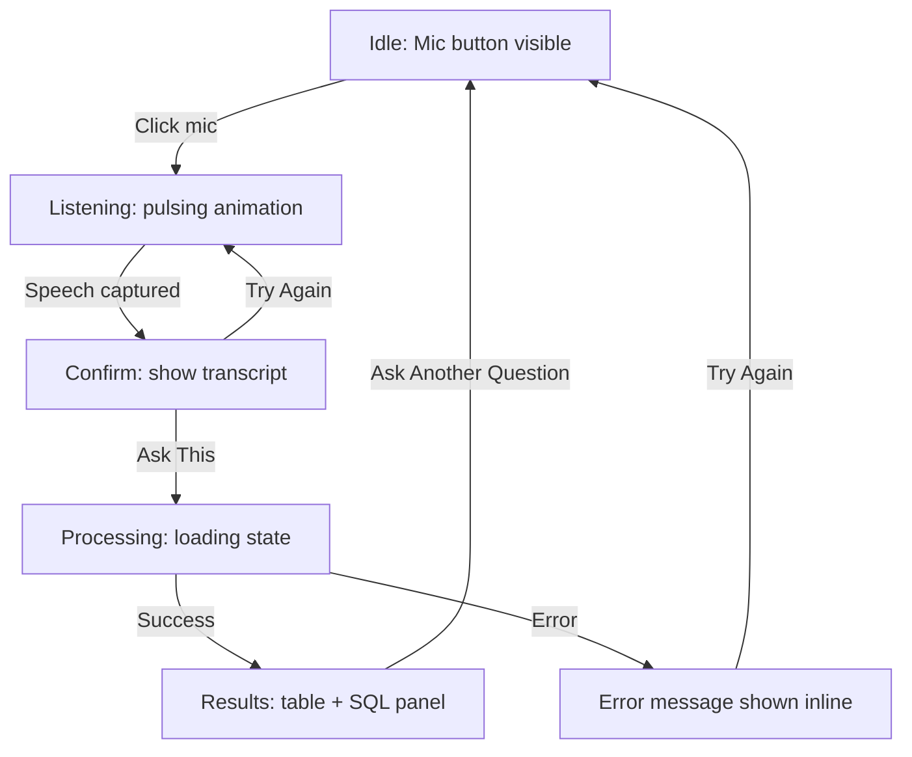

# VoiceSQL — UI & User Flow

Status: Finalized Day 2. Implement exactly this state machine on Day 4 (layout/voice) and Day 5 (wiring). One page, no multi-screen navigation — every state below lives in `frontend/index.html`, toggled by `frontend/app.js`.

## User Flow Diagram



## Screen Flow (Single Page, State-Driven)

This is intentionally **not** a multi-page app. There is one screen (`index.html`) that visually transforms through six states. This keeps navigation trivial (there is none) and matches the PRD's scope for a fast, focused demo tool.

### State 1 — Idle
```
┌─────────────────────────────────────┐
│  VoiceSQL                            │
│                                       │
│         [ 🎤 mic button ]            │
│                                       │
│   "Ask your database a question"     │
└─────────────────────────────────────┘
```
Purpose: entry point. Only interactive element is the mic button.

### State 2 — Listening
```
┌─────────────────────────────────────┐
│  VoiceSQL                            │
│                                       │
│      [ 🎤 pulsing animation ]        │
│         "Listening..."               │
│                                       │
└─────────────────────────────────────┘
```
Purpose: clear feedback that the mic is live (Day 7 priority feature).

### State 3 — Confirm
```
┌─────────────────────────────────────┐
│  VoiceSQL                            │
│                                       │
│  "Show top 5 customers by spending"  │
│                                       │
│  [ Ask This ]      [ Try Again ]     │
└─────────────────────────────────────┘
```
Purpose: lets the user catch a misheard transcript before spending an AI call — exists specifically to protect voice UX quality.

### State 4 — Processing
```
┌─────────────────────────────────────┐
│  VoiceSQL                            │
│                                       │
│         ⏳ Thinking...                │
│                                       │
└─────────────────────────────────────┘
```
Purpose: feedback during the `/query` network round-trip.

### State 5 — Results
```
┌─────────────────────────────────────┐
│  VoiceSQL                            │
│  ┌─────────────────────────────────┐ │
│  │ name      | total_spent          │ │
│  │ Alice     | 1,204.50              │ │
│  │ Bob       |   980.00              │ │
│  └─────────────────────────────────┘ │
│                                       │
│  ▶ Show SQL                          │
│                                       │
│  [ Ask Another Question ]            │
└─────────────────────────────────────┘
```
Purpose: the payoff screen. Results table is primary; SQL panel is collapsible (Day 8 priority — transparency, not the main focus).

### State 6 — Error
```
┌─────────────────────────────────────┐
│  VoiceSQL                            │
│                                       │
│   ⚠ Didn't catch that, try again     │
│                                       │
│         [ Try Again ]                │
└─────────────────────────────────────┘
```
Purpose: never a blank screen or console-only error — every failure mode from `API.md` maps to a friendly message here.

## Navigation

None required. There are no menus, tabs, routes, or secondary pages in v1.0. This is a deliberate scope decision: a single evolving screen is faster to build correctly in the remaining hours and matches how the product is meant to be demoed — one continuous interaction, not a multi-page exploration.

## Screen Justification (every screen exists for a reason)

| Screen | Why it must exist |
|---|---|
| Idle | Entry point; nothing works without it |
| Listening | Required voice UX feedback (PRD priority #1) |
| Confirm | Protects against misheard transcripts wasting an AI call, improves trust |
| Processing | Prevents user confusion during the ~2-5s AI round trip |
| Results | The actual product value — this is the "yes it works" moment |
| Error | Required so failures never look like the app broke |

No screen was added "for completeness" — each ties directly to either a core feature or a failure mode identified in `API.md`.
